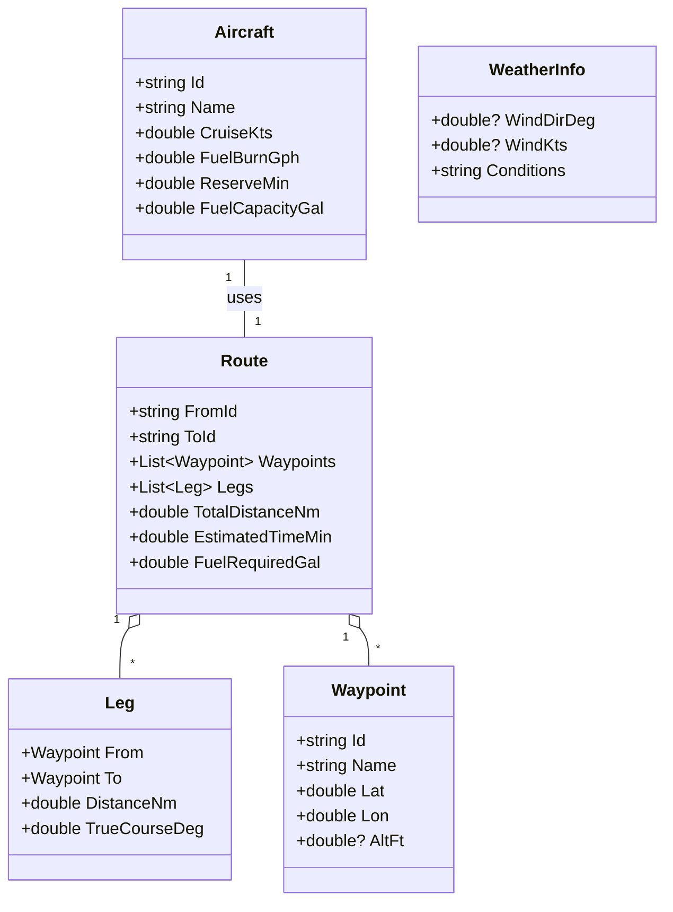
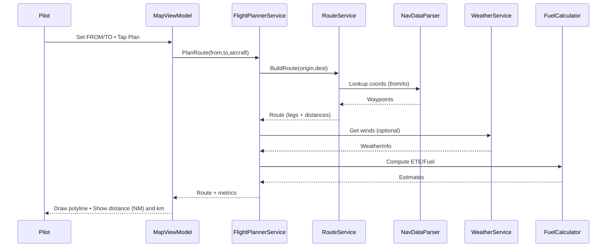
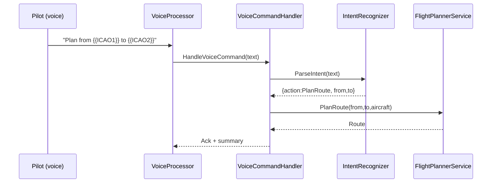
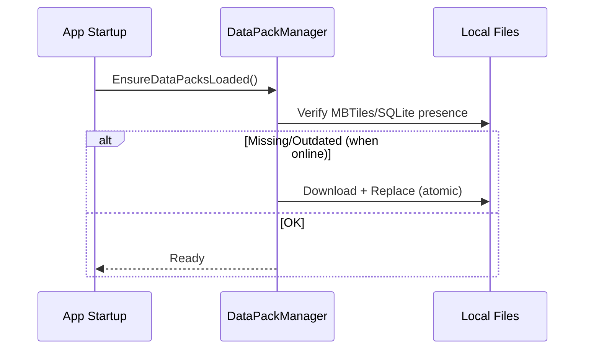
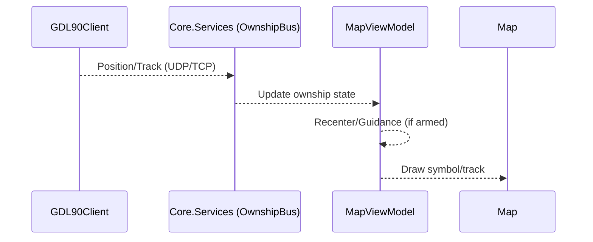
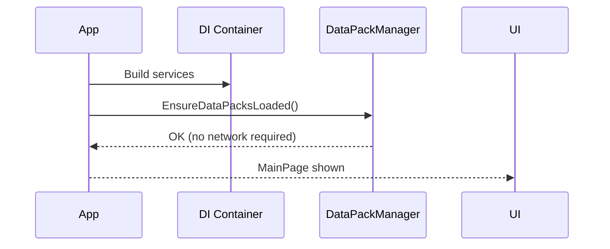

# Flight Planner – Architecture & Flows
**Version:** 0.1 • **Date:** 2025-08-17 • **Target:** .NET MAUI (Android/Windows) • **Scope:** Single-aircraft, offline-first

---

## 1) Objectives
1. Interactive route planning (FROM→TO, waypoints) with straight-line legs.
2. Show total distance (NM, with km secondary in UI), ETE, fuel (per aircraft profile).
3. Full offline support: basemap (MBTiles), nav DB (SQLite/JSON), cached weather.
4. Commandable kernel: JSON‑RPC + voice intents (local parsing first; AI-ready).
5. Modular, testable, high‑performance on tablets.

## 2) Quality Attributes (NFR)
1. **Performance:** map pan <150 ms; plan recompute <250 ms typical; UI 60 fps.
2. **Reliability:** offline‑first; graceful data aging; deterministic planning.
3. **Security:** local‑only RPC by default; token auth; least‑privilege services.
4. **Maintainability:** clean architecture; DI; interface‑driven; testable.
5. **Portability:** MAUI UI; platform services abstracted; no Linux target in this phase.

---

## 3) System Context (C4‑L1)
```mermaid
flowchart LR
  Pilot((Pilot))
  Voice[PTT/Wake + Mic]
  App[MAUI Flight Planner App]
  Packs[(Offline Data Packs
MBTiles • SQLite • JSON)]
  ADSB[(GDL90 / GPS source
(optional mock during dev))]
  OS[Android / Windows OS]

  Pilot -- Touch/Voice --> App
  Voice -- Audio --> App
  Packs <-- Read/Update --> App
  ADSB -- UDP/TCP (local) --> App
  App --- OS
```
**Notes:** App operates offline; optional live inputs via local network/USB.

---

## 4) Container View (C4‑L2)
```mermaid
flowchart TB
  subgraph Device[Tablet: Android / Windows]
    UI[UI.MAUI
Views + ViewModels]
    Core[Core.Services
FlightPlanner • Route • Weather • Fuel]
    Domain[Core.Domain
Route • Leg • Waypoint • Aircraft]
    Data[Data
DataPackManager • NavData • MapData • WeatherCache]
    Interop[Interop
JSON‑RPC Router • Command API]
    AI[AI.Kernel
IntentRecognizer • VoiceProcessor • Memory]
    Conn[Connectivity
GDL90Client • Sensors]
    Infra[Shared.Infrastructure
DI • Logging • Settings]

    UI --> Core
    UI --> Interop
    Interop --> Core
    AI --> Interop
    AI --> Core
    Core --> Data
    Core --> Domain
    Data --> Domain
    Conn --> Core
    Infra --- UI
    Infra --- Core
    Infra --- Data
    Infra --- Interop
    Infra --- AI
  end

  Storage[(Local Storage
MBTiles • SQLite • Files)]
  Network[(Local Net)
(when available)]

  Data <---> Storage
  Conn <---> Network
```
**Tech:** .NET 8/9, MAUI, SQLite, MBTiles/PMTiles, DI (Microsoft.Extensions).

---

## 5) Component View – Flight Planning
```mermaid
flowchart LR
  VM[MapViewModel] --> FP[IFlightPlanner
FlightPlannerService]
  FP --> RS[IRouteService
RouteService]
  FP --> WS[IWeatherService
WeatherService (stub/offline)]
  FP --> FC[FuelCalculator]
  RS --> ND[NavDataParser
(airport/waypoint lookup)]
  WS --> WC[WeatherDataService
(cached winds/METAR)]
  ND --> DB[(Nav DB SQLite/JSON)]
  WC --> WX[(Weather cache files)]
```
**Flow:** VM collects inputs → FlightPlanner composes route → RouteService computes legs/distance → WeatherService provides winds (stub) → FuelCalculator outputs fuel/ETE.

---

## 6) Domain Model (simplified)


---

## 7) Key Flows (Sequences)

### 7.1 Plan Route (UI)


### 7.2 Voice Command → Plan


### 7.3 Data Pack Update (offline-first)


### 7.4 Live Ownship Update → Overlay


### 7.5 Offline Startup


---

## 8) Deployment View
```mermaid
flowchart LR
  subgraph Android Tablet
    APK[MAUI App (AAB/APK)]
    Store[(Local: MBTiles/SQLite/JSON)]
  end
  subgraph Windows Tablet
    EXE[MAUI WinUI3 App]
    StoreW[(Local: MBTiles/SQLite/JSON)]
  end
  APK---Store
  EXE---StoreW
  note right of APK: No internet required at runtime
  note right of EXE: Optional local UDP for GDL90
```

---

## 9) Security Model
1. Local‑only JSON‑RPC (loopback). 
2. Token‑based auth; per‑command ACL (arm/safe gate).
3. Sandboxed file I/O; signed data packs (future).
4. PTT for voice to reduce false triggers.

## 10) Configuration
1. `appsettings.json` (units, themes, feature flags).
2. `AircraftProfile.json` (single aircraft).
3. Region data pack path(s).

## 11) Error Handling
1. User‑facing: concise alerts; retry for data packs.
2. Logs: structured (timestamp, event, payload hash).
3. Guards: nulls/NaN checks; fallback defaults.

## 12) Extension Points
1. Replace WeatherService (live API) without UI changes.
2. Swap Map renderer (Mapsui/MapLibre) via adapter.
3. Plug real STT/TTS; add LLM in IntentRecognizer.
4. Add procedures/SID/STAR service behind IProcedureService.

## 13) Risks & Mitigations
1. Map offline rendering complexity → adapter + staged Mapsui.
2. Voice accuracy in noise → PTT + grammar-first parse.
3. Data licensing (charts) → start with open/community + stubs.

---

### Appendix A – Command Grammar (JSON‑RPC, local)
```json
{{"cmd":"plan_route","args":{{"from":"YBBN","to":"YSSY"}}}}
{{"cmd":"zoom_to","args":{{"lat":-27.385,"lon":153.117,"scale_nm":25}}}}
{{"cmd":"clear_route"}}
```

### Appendix B – Units
- Primary: NM; Secondary display: km (UI).
- Altitude stored in meters internally; UI may show ft secondary.
